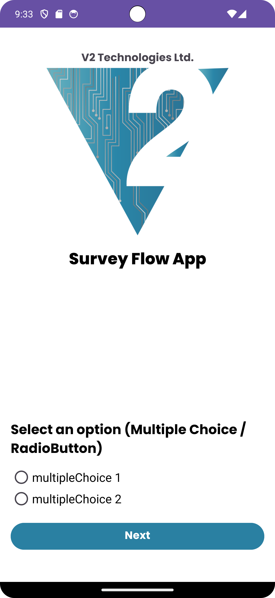
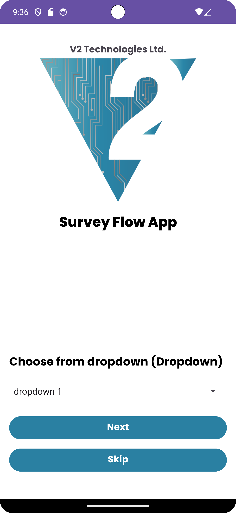
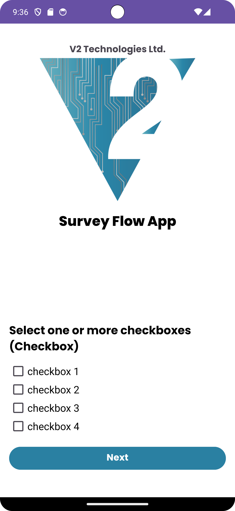
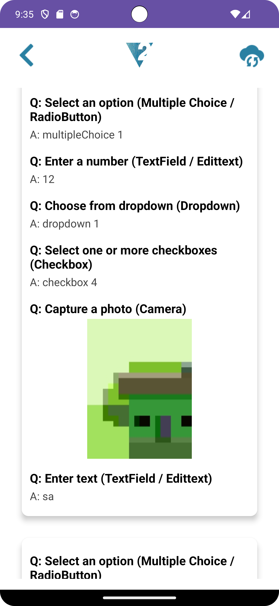
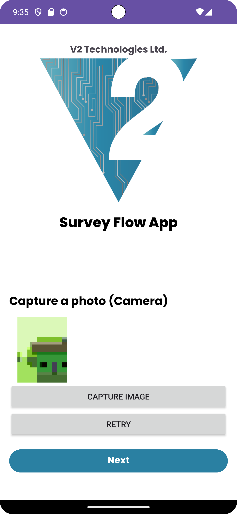

# Survey Form App (Dynamic Q&A Form)

This is a dynamic question-and-answer based survey Android application built using **MVVM**, **Retrofit**, **Room**, and **Firebase**. The form is generated from a remote JSON schema and supports various input types like text, numbers, multiple-choice, dropdowns, checkboxes, and image capture.

---

## Features

- ✅ Dynamic form rendering based on remote JSON schema
- 📝 Supports input types:
  - Multiple Choice (Radio Buttons)
  - Text Input
  - Number Input
  - Checkboxes
  - Dropdown (Spinner)
  - Camera Image Input
- 🔄 Conditional Navigation (`referTo` and `skip` logic)
- 🔐 Answer Validation with Regex
- ☁️ Submit to Firebase Firestore and Storage
- 📴 Offline Support via Room DB
- ⚠️ **Internet Detection on Submit**:
  - If no internet → shows alert dialog
  - Asks to store answers locally using **Room**
- 🔁 **Auto-sync when internet is restored**
- 🔘 **Manual Retry Sync button** on Result screen
- 📷 Image Preview before submission
- 📦 View all previous submissions in a decorated `RecyclerView`
- 🧠 Dynamic question lookup using `questionId`
- 📍 Offline image storage for local review

---

## 📦 Tech Stack

| Layer       | Technology                    |
|-------------|-------------------------------|
| UI          | XML Layouts                   |
| Arch        | MVVM                          |
| Network     | Retrofit                      |
| Offline DB  | Room                          |
| Cloud DB    | Firebase Firestore            |
| File Upload | Firebase Storage              |
| Tools       | Coroutines, ViewModel, LiveData |

---

## 📱 Screenshots

| Dynamic Form | Result Viewer | Image Preview |
|--------------|----------------|---------------|
|      |      |     |

---

## ⚠️ Notes

- 🔥 **Firebase Storage requires a Blaze Plan** for storing images at scale
  - Free (Spark) plan may have limitations when uploading files
  - As Free plan doesnot have Firebase Storage facility, Stores the ImagePath as a String in Firestore
- 💾 **Offline image files are stored locally**
  - File path is saved in Room and shown in result screen
- 🔄 **Retry sync works only when internet is restored**
  - Auto-sync triggers once connectivity is available again
- 📥 **Room stores only one survey submission at a time**
  - Meant for offline fallback and later syncing to Firebase

---

## 📱 APK Download

[Download the Final APK](apk/release/app-release.apk)

---

## 🧑‍💻 Author

**Tawhid Mirza Mahib**

- 🎓 BSc in Computer Science & Engineering, Jagannath University
- 📱 Android & Mobile App Developer
- 🌐 [LinkedIn](https://www.linkedin.com/in/tawhid-mirza-mahib/)
- 💻 [GitHub](https://github.com/mirzatawhid)
- 📧 Email: [mirzatawhid89@gmail.com](mailto:mirzatawhid89@gmail.com)
